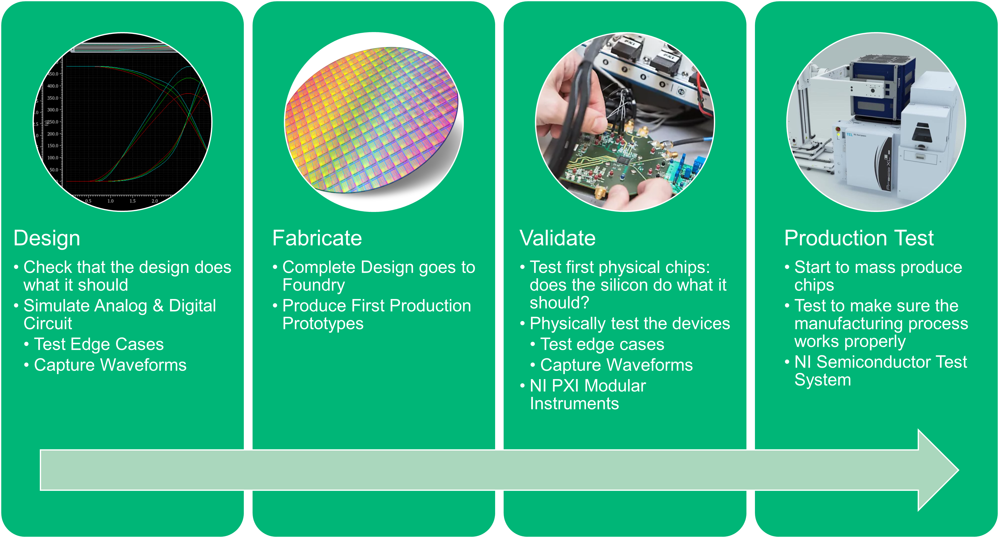

# Waveform Images: Machine Learning
This repo is for the colaboration betwen [NI's Semiconductor and Electronic's](https://www.ni.com/en-us/solutions/semiconductor.html) Systems R&D team and the [BYU Colege of Physical and Mathematical Sciences](https://science.byu.edu/) Capstone projects. 

# Project Overview

## Introduction

NI’s Semiconductor and Electronics Business Unit is working on a suite of products that enables Electrical Engineers working on semiconductor products to easily find and visualize their data across design, validation, and production test. 

Here is a video of one of my team members discussing the vision for the space we’re talking about: [Bridge Semiconductor Design to Test through a Data Platform - YouTube](https://www.youtube.com/watch?v=umfbQ3IY3fU&ab_channel=NI)

An important part of this workflow is that design and validation engineers need to be able to find, visualize, and analyze waveforms.

### Waveform
> A set of data series with a single independent and multiple dependent variables. Typically, the independent variable (x) is time (0ns – 10ns, step 1ps) but may also be a sweep of electrical frequencies (ex. 1MHz – 100MHz, step .1MHz), or a sweep of voltage, current, or another electrical characteristic. Waveforms typically have 100,000 to 10,000,000 points per variable.

Waveforms are often captured as raw numerical results; however, they are often also captured as screen captures or images of traces from an instrument or simulation program. 

## Project Vision
Create a AI/ML approach to classifying images of waveform data

1. Group similar waveforms.
2. Tag images of waveforms that require further analysis due to anomalies.

# Getting Started
After cloning the repo, do the following:
1. run `pip install -r requirements.txt` to install required python packages
2. run `python RandomWaveform.py` to generate a set of waveform images
